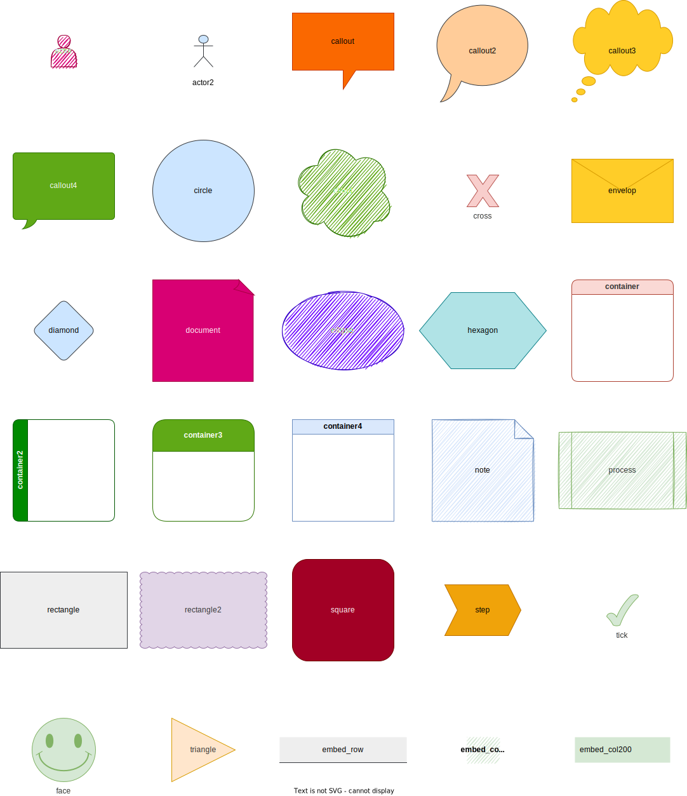

# Drawio Dsl

> DrawIO DSL can build DrawIO diagrams using a Domain Specific Language

## ToDo

- Diagram needs to support background color and it needs to trickle down to pages

## Installation

Add this line to your application's Gemfile:

```ruby
gem 'drawio_dsl'
```

And then execute:

```bash
bundle install
```

Or install it yourself as:

```bash
gem install drawio_dsl
```

## Stories

### Main Story

As a Developer, I to use natural language to build diagrams quickly, so that I can create visual documentation

See [project plan](./docs/project-plan.md)

## Samples

See all [samples](./docs/samples/samples.md)



## Architecture

### Domain 

Domain modal and class diagram can be found [here](docs/domain-modal.md)

### Development

Checkout the repo

```bash
git clone 
```

After checking out the repo, run `bin/setup` to install dependencies. Then, run `rake spec` to run the tests. 

You can also run `bin/console` for an interactive prompt that will allow you to experiment.

```bash
bin/console

Aaa::Bbb::Program.execute()
# => ""
```

`drawio_dsl` is setup with Guard, run `guard`, this will watch development file changes and run tests automatically, if successful, it will then run rubocop for style quality.

To release a new version, update the version number in `version.rb`, build the gem and push the `.gem` file to [rubygems.org](https://rubygems.org).

```bash
rake publish
rake clean
```

## Contributing

Bug reports and pull requests are welcome on GitHub at https://github.com/klueless-io/drawio_dsl. This project is intended to be a safe, welcoming space for collaboration, and contributors are expected to adhere to the [Contributor Covenant](http://contributor-covenant.org) code of conduct.

## License

The gem is available as open source under the terms of the [MIT License](https://opensource.org/licenses/MIT).

## Code of Conduct

Everyone interacting in the Drawio Dsl project’s codebases, issue trackers, chat rooms and mailing lists is expected to follow the [code of conduct](https://github.com/klueless-io/drawio_dsl/blob/master/CODE_OF_CONDUCT.md).

## Copyright

Copyright (c) David Cruwys. See [MIT License](LICENSE.txt) for further details.
