# Extensions

## standard

## flowchart

## containers

## geometric_shapes

## misc

## android_inputs

## i_os_mockups

## i_os_ui_components

## mind_map

## uml_class_diagram

## uml_use_case

## uml_state_activity

## uml_sequence

## uml_component

## uml_entity_relationship

## bpmn_2_0

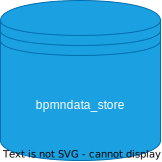

## data_flow

## processes

## materials

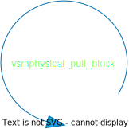

## shipments

## information

## value_stream_mapping

## kanban

## arrows

## ec2

## networking

## s3

## content_delivery

## database

## security_identity

## app_services

## deployment

## on_demand

## sdks

## analyti_cs

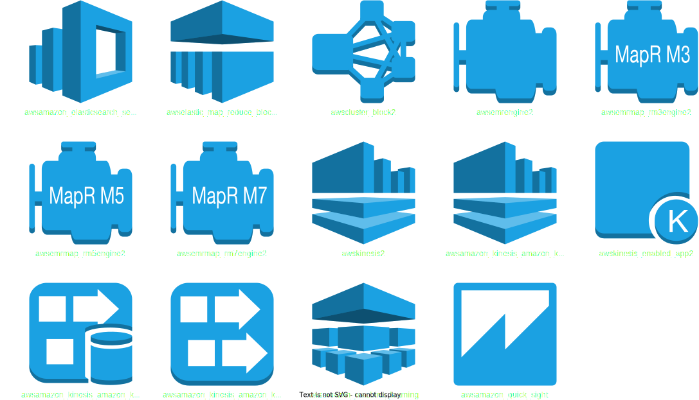

## mobile_services

## developer_tools

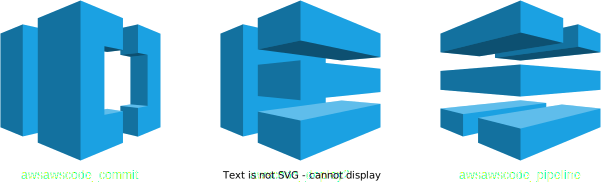

## enterprise_application

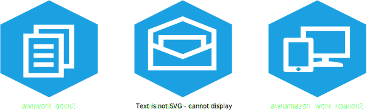

## internet_of_things

## aws_general

## azure_cloud

## azure_enterprise

## azure_vms

## azure2019

## cisco_basic

## cisco_extended

## computers_and_monitors

## detailed_network_diagrams

## basic_network_shapes

## server_racks

## network

## electroni_cs

## electrical

## power_sources

## transistors

## logic_gates

## miscellaneous

## messaging_systems

## messaging_channels

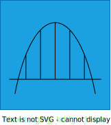

## message_routing

## message_transformation

## messaging_endpoints

## system_management

## google_cloud_platform

## kubernetes_icons

## doors_windows

## stairs

## desks

## cubicle_walls

## tables_chairs

## restroom

## beds

## appliances

## kitchen

## couches

## technology

## misc_floorplan

## equipment

## piping

## vessels

## heat_exchangers

## pumps

## instruments

## valves

## venn_gradient

## venn_plain

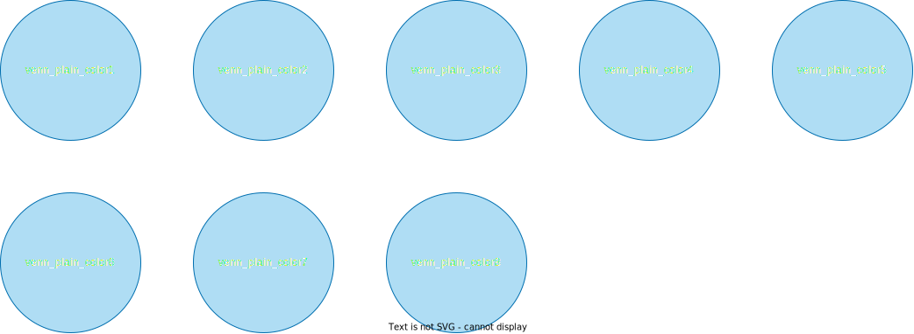

## i_os_devices

## i_phone_elements

## i_pad_elements

## common_elements

## i_os_icons

## ui_containers

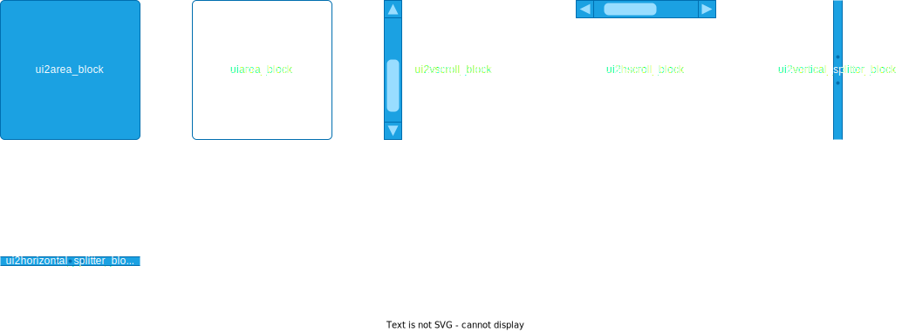

## ui_widgets

## ui_input

## ui_menus

## ui_misc

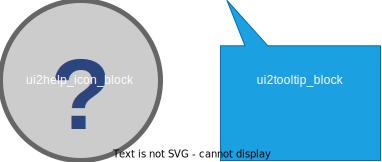

## i_os_6_i_pad_elements

## i_os_6_i_pad_controls

## i_os_6_i_pad_icons

## i_os_6_i_phone_elements

## i_os_6_i_phone_controls

## i_os_6_i_phone_icons

## aws_17___analyti_cs

## aws_17___application_services

## aws_17___artificial_intelligence

## aws_17___business_productivity

## aws_17___compute

## aws_17___contact_center

## aws_17___containers

## aws_17___database

## aws_17___desktop_app_straning

## aws_17___developer_tools

## aws_17___game_development

## aws_17___general

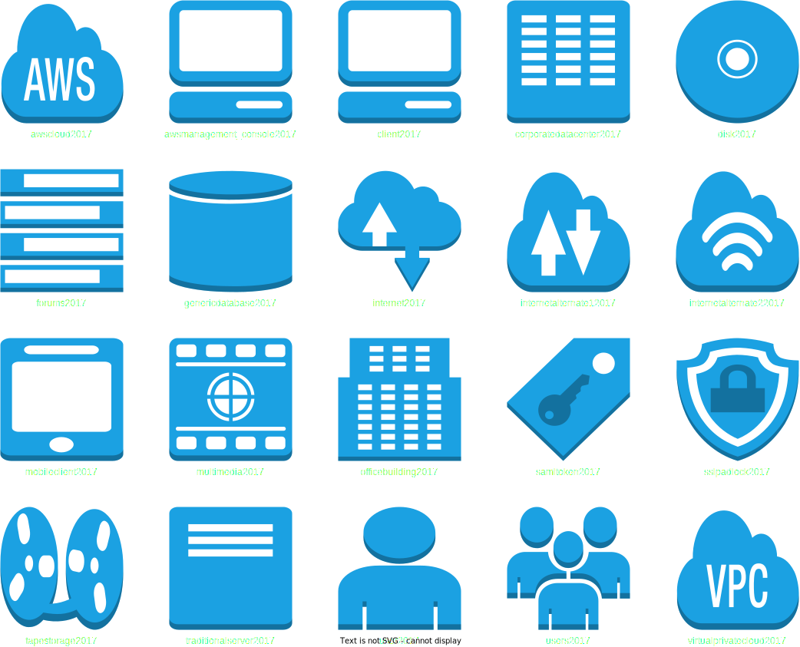

## aws_17___io_t

## aws_17___management

## aws_17___messaging

## aws_17___migration

## aws_17___mobile_services

## aws_17___networking_content_delivery

## aws_17___on_demand_workforce

## aws_17___sdks

## aws_17___serurity_identity_and_compliance

## aws_17___storage

## aws_19_analyti_cs

## aws_19___application_integration

## aws_19___ar_vr

## aws_19___blockchain

## aws_19___business_applications

## aws_19___compute

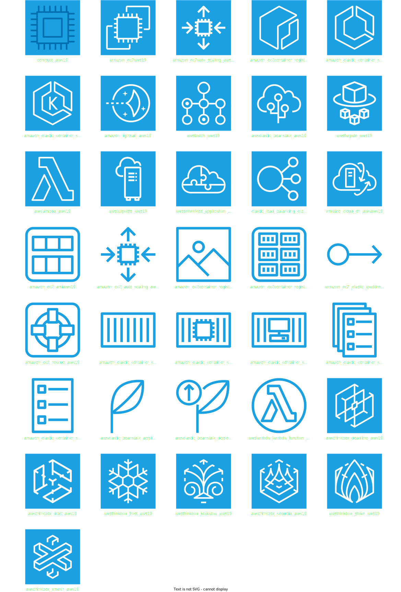

## aws_19___cost_management

## aws_19___customer_engagement

## aws_19___database

## aws_19___desktop_app_streaming

## aws_19___developer_tools

## aws_19___ec2_instance_types

## aws_19___game_tech

## aws_19___general

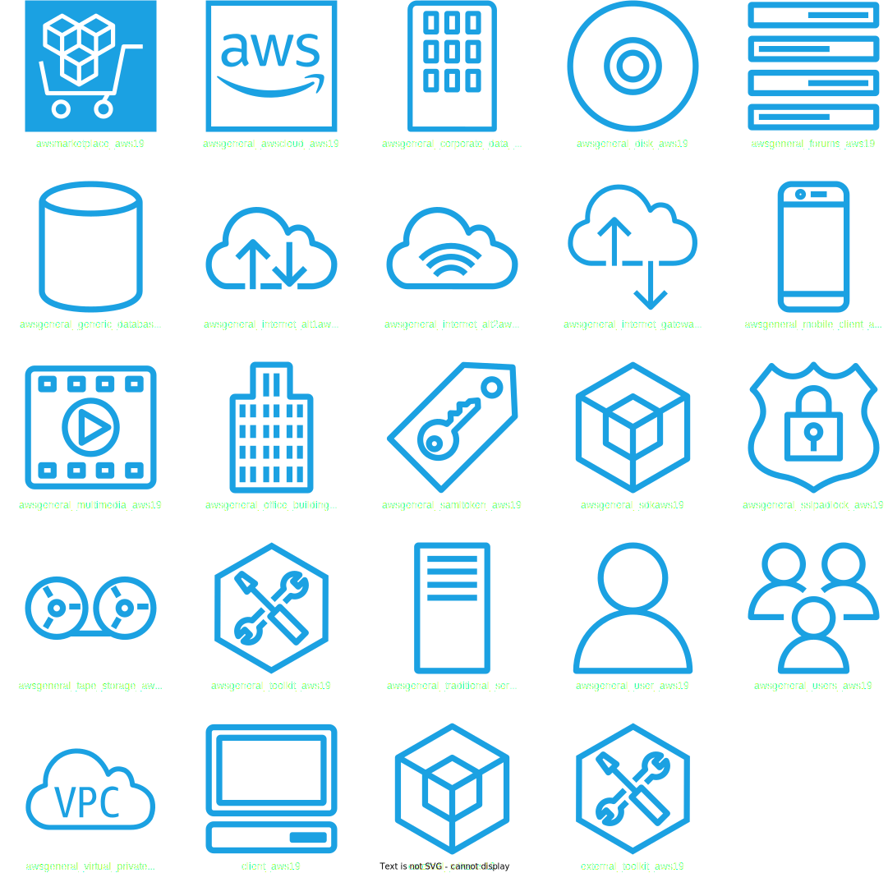

## aws_19___groups_note_repeated_below_without_v2

## repeated_from_the_above

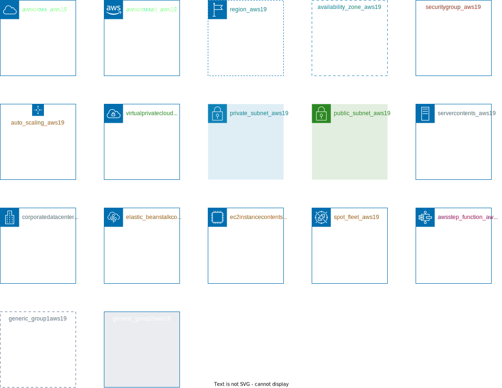

## aws_19___internet_of_things

## aws_19___machine_learning

## aws_19___management_governance

## aws_19___media_services

## aws_19___migration_transfer

## aws_19___mobile

## aws_19___networking_content_delivery

## aws_19___roboti_cs

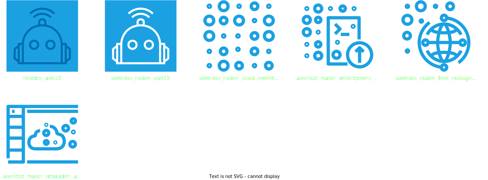

## aws_19___satellite

## aws_19___security_identity_compliance

## aws_19___storage

## site_map

## ext_shapes

