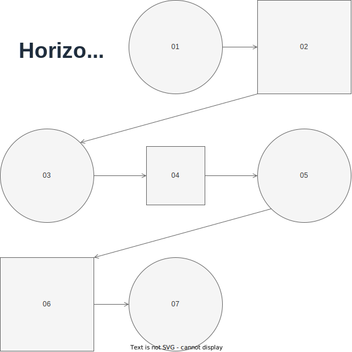
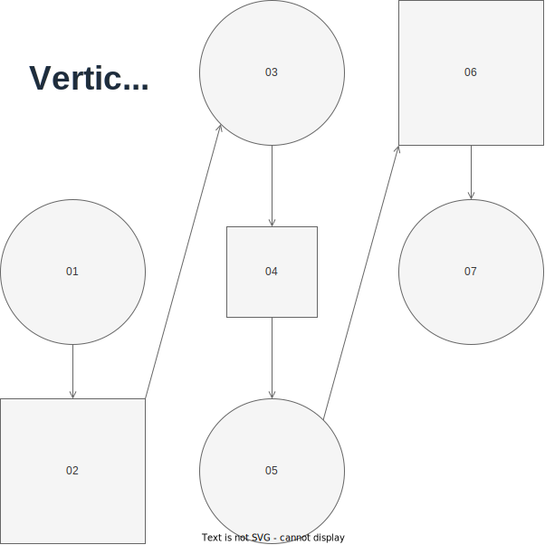
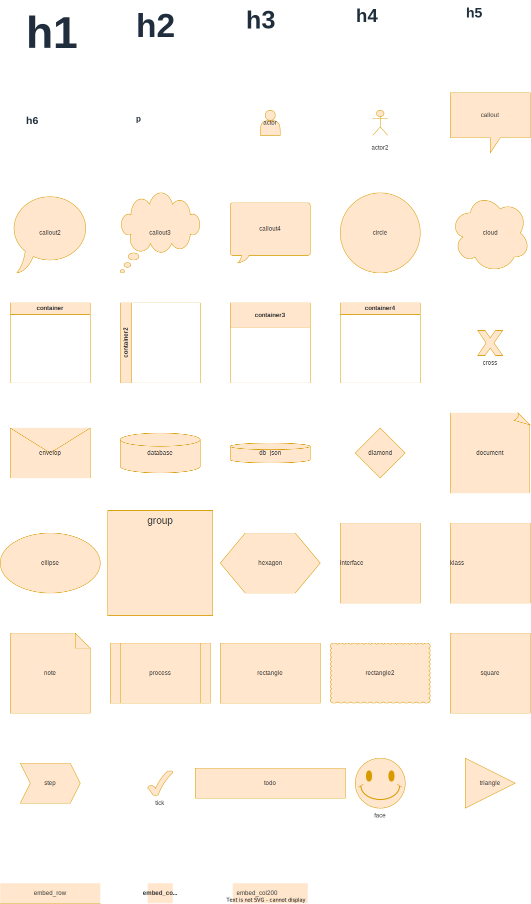
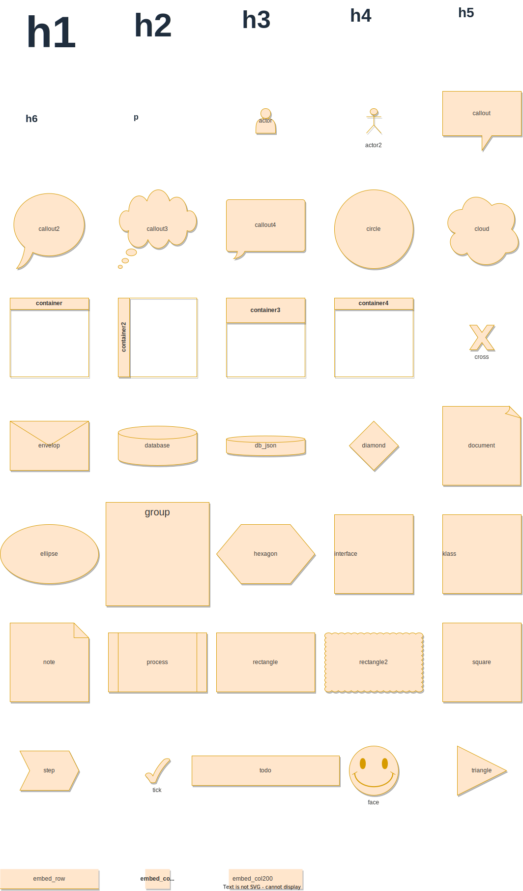
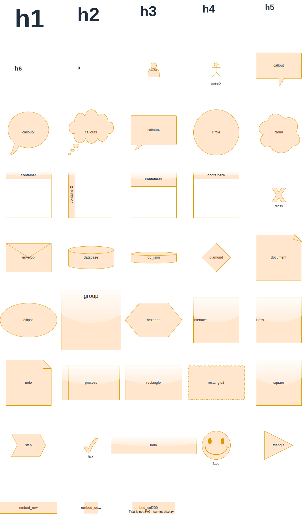
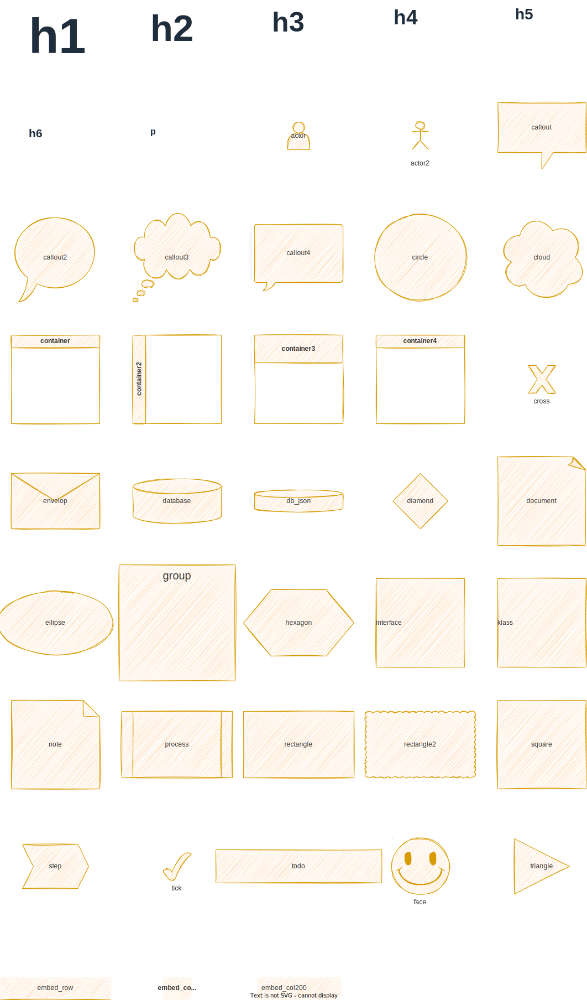
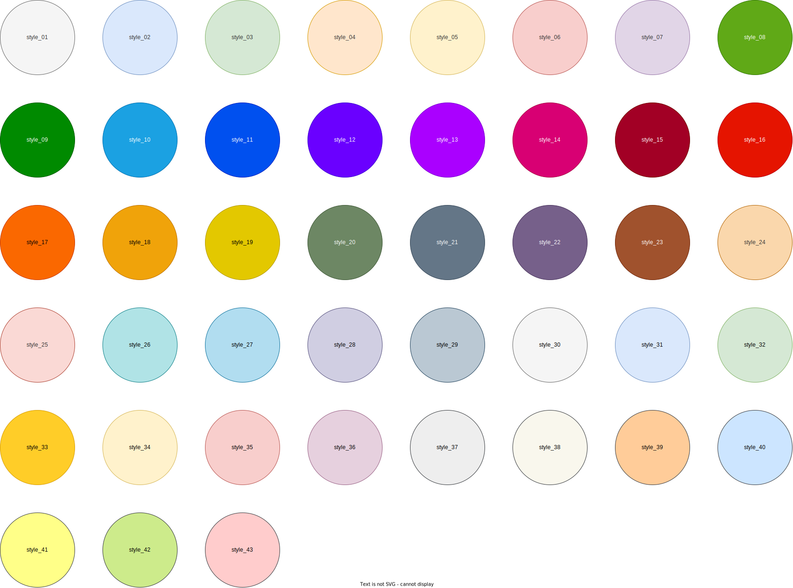
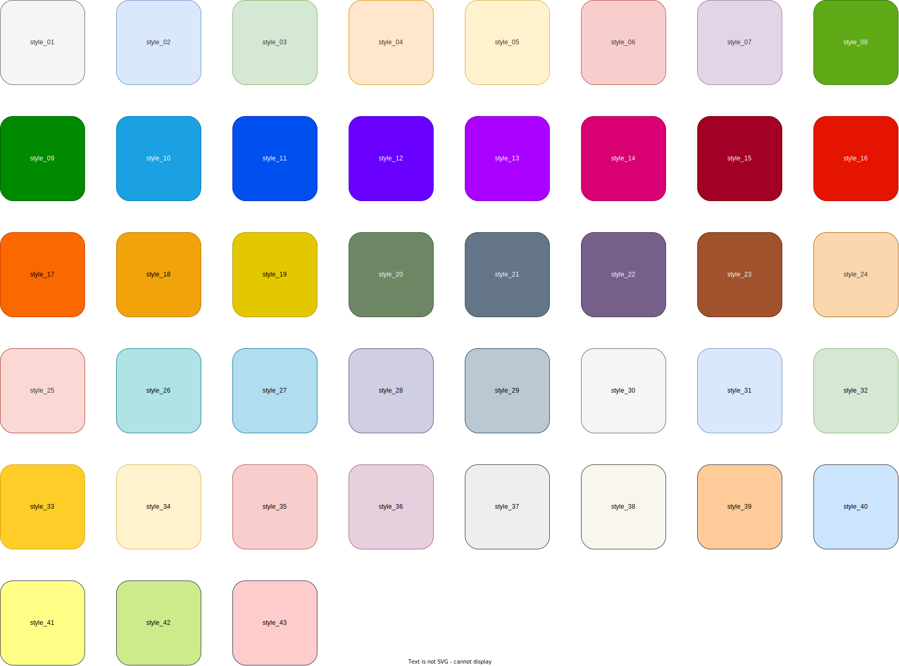
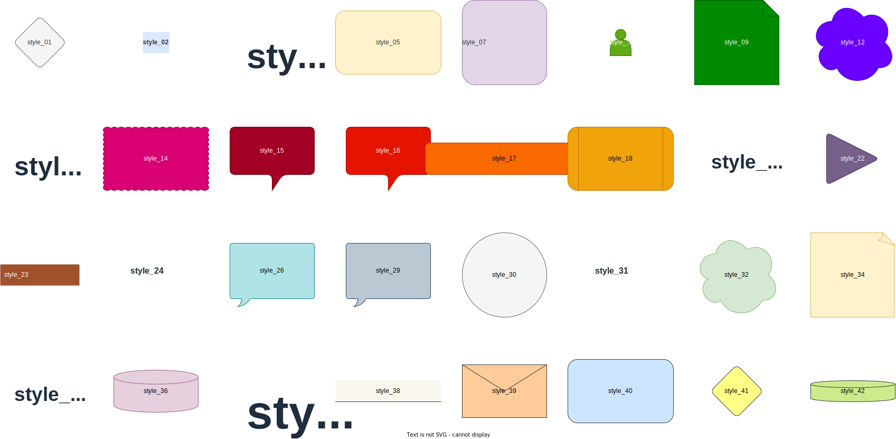

# Samples

## Grid flow - Horizontal

## Grid flow - Vertical

## Styles

## Plain

### Shadow

### Rounded

### Glass

### Sketch

## Themes

### As circles

### As squares

### As random shapes

## Copyright

Copyright (c) David Cruwys. See [MIT License](LICENSE.txt) for further details.
